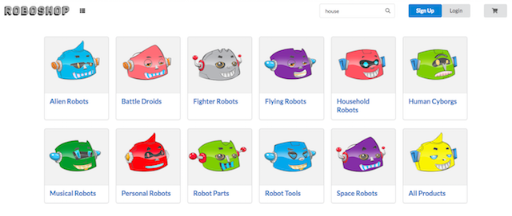

  

RoboShop is a e-commerce web application featuring a product catalog with search and filtering, a shopping cart and checkout using the [Stripe API](https://stripe.com/docs/api). It was built using [React](https://github.com/facebook/react), [Redux](https://redux.js.org/), [Express](https://github.com/expressjs/express), [Sequelize](http://docs.sequelizejs.com/), and [Postgres](https://www.postgresql.org/docs/).

This project was created by three students at [Fullstack Academy](https://www.fullstackacademy.com/) in Chicago. We had a week and a half to put together an e-commerce site. We got to choose our products, company name, and design, but there were certain features our site was required to have. On RoboShop, guests can select and buy items, or decide to log in as a user (and have a cart that persists), write reviews, and check out.

## Live Demo

https://robot-shop.herokuapp.com/

### Login credentials

| Username        | Password |
| --------------- | -------- |
| admin@admin.com | admin    |
| test@test.com   | test     |

These credentials will work with the deployed application and a local install.

### Preview

## Getting Started

These instructions will get you a copy of the project up and running on your local machine for development purposes.

### Prerequisites

These technologies are required:

* Node.js
* PSQL

### Installing

After cloning the repository, follow these steps:

* `npm install`
* Create two PostgreSQL databases: `roboshop` and `roboshop-test`
* `npm seed`
* `npm run start-dev`
* Navigate to http://localhost:8080/

## Built With

* [React](https://github.com/facebook/react) - JavaScript library for building user interfaces
* [Redux](https://redux.js.org/) - front end state management
* [Express](https://github.com/expressjs/express) - web framework for Node
* [Sequelize](http://docs.sequelizejs.com/) - database queries
* [Postgres](https://www.postgresql.org/docs/) - object-relational database management system
* [Stripe API](https://stripe.com/docs/api) - official Stripe REST API
* [Semantic-UI](https://github.com/Semantic-Org/Semantic-UI-React) - UI component framework

## Developers

* [Hollie Lambert](https://github.com/hollielu)
* [Eliot Davis](https://github.com/edavis221)
* [Jerry Wu](https://github.com/wujerry573)
